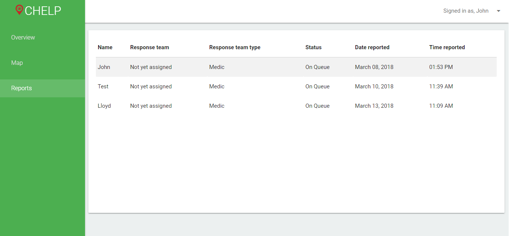
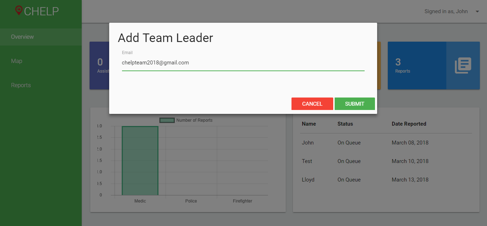

# CHELP-Call-for-Help
Emergency Response Application Using Android Application and Geolocation for Emergency Units that give the users the immediate response or assistance they need from the authorities

# Screenshots

